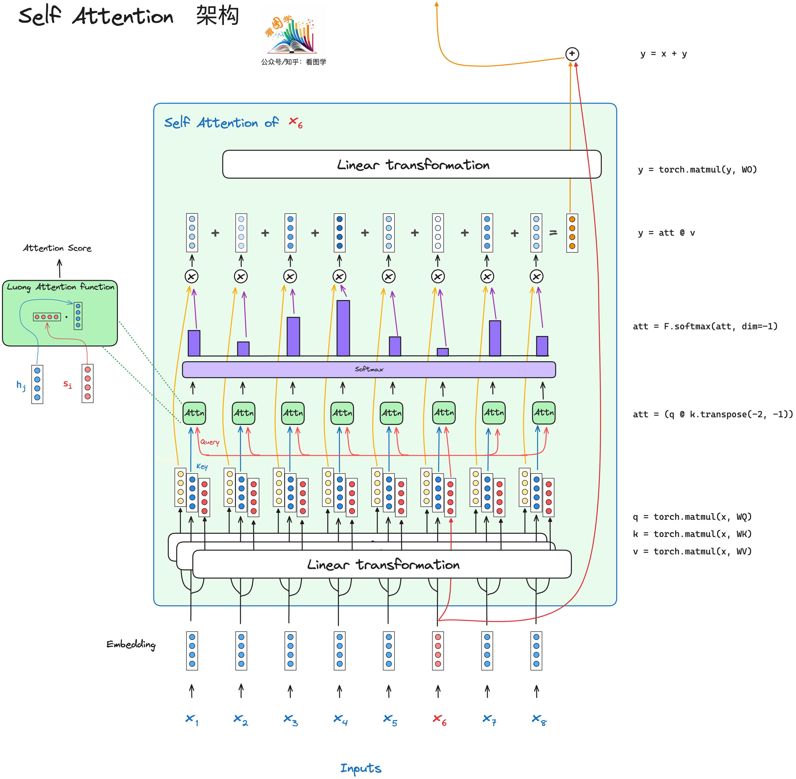
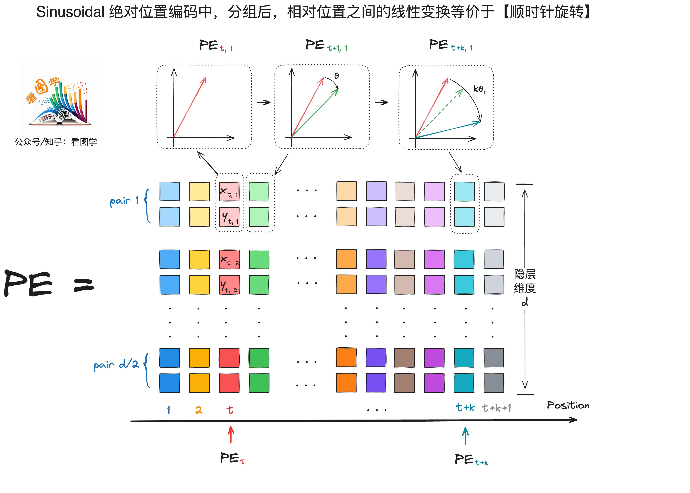
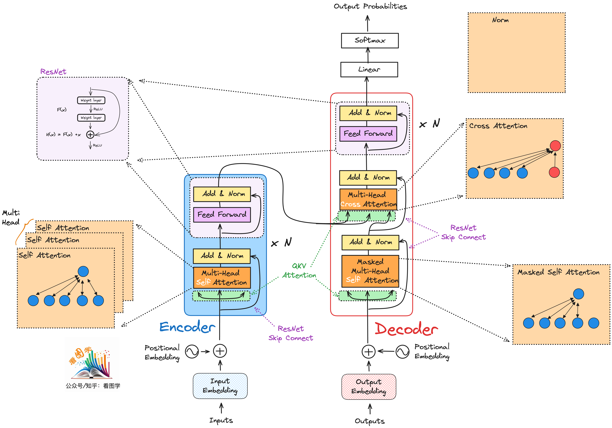
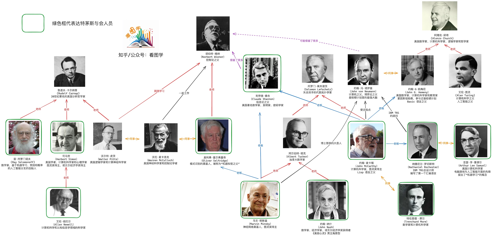

# llm_illustrated

本电子书目前进度完成不到 10%，可以关注下方公众号回复 "看图学大模型" 来获取最新版。

节选一些文章的图片，尽量用清晰易懂的方式来讲述大模型相关技术。

比如 

# self attention 的结构和代码：

# 绝对位置编码的解释

# KV Cache 图解

# transformers 的组成

# 达特茅斯会议参与人员关系图谱

目前 PDF 排版等还略有问题，Latex 还需要略微调整。

